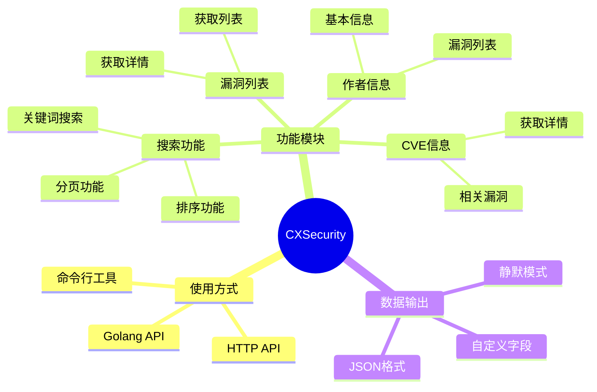

# CXSecurity Crawler

[](https://github.com/scagogogo/cxsecurity-crawler/actions/workflows/go-test.yml)
[](https://codecov.io/gh/scagogogo/cxsecurity-crawler)
[](https://github.com/scagogogo/cxsecurity-crawler/actions/workflows/test-examples.yml)

一个用于爬取 CXSecurity 网站漏洞数据的工具。可以作为命令行工具使用，也可以作为Go库集成到其他项目中，还提供HTTP API服务。

## 功能概览



## 目录

- [功能特性](#功能特性)
- [安装说明](#安装说明)
- [命令行使用](#命令行使用)
  - [漏洞列表命令](#漏洞列表命令)
  - [CVE详情命令](#cve详情命令)
  - [作者信息命令](#作者信息命令)
  - [搜索命令](#搜索命令)
- [Golang API](#golang-api)
  - [HTTP客户端](#http客户端)
  - [漏洞列表API](#漏洞列表api)
  - [CVE详情API](#cve详情api)
  - [作者信息API](#作者信息api)
  - [搜索API](#搜索api)
  - [数据模型](#数据模型)
- [HTTP API](#http-api)
  - [服务启动](#服务启动)
  - [认证方式](#认证方式)
  - [接口列表](#接口列表)
- [示例代码](#示例代码)
- [数据格式](#数据格式)
- [开发贡献](#开发贡献)
- [许可证](#许可证)

## 功能特性

- 漏洞数据获取
  - 爬取漏洞列表和详情页面
  - 支持CVE详情查询
  - 获取作者信息和历史漏洞
  - 关键词搜索功能
- 多种使用方式
  - 命令行工具
  - Golang API库
  - HTTP API服务
- 数据处理
  - JSON格式输出
  - 自定义输出字段
  - 分页和排序支持
- 其他特性
  - 完善的错误处理
  - 自动重试机制
  - 详细的使用文档

## 安装说明

### 从源码编译

```bash
# 克隆仓库
git clone https://github.com/scagogogo/cxsecurity-crawler.git
cd cxsecurity-crawler

# 编译
go build -o cxsecurity

# 运行测试
go test ./...
```

### 使用go get安装

```bash
go get github.com/scagogogo/cxsecurity-crawler
```

## 命令行使用

### 漏洞列表命令

获取漏洞列表或详细信息：

```bash
# 获取漏洞列表（默认第1页）
./cxsecurity exploit

# 获取指定漏洞详情
./cxsecurity exploit -i WLB-2024040035 -o result.json

# 指定输出字段
./cxsecurity exploit -i 2024040035 -f "title,url,date"

# 静默模式运行
./cxsecurity exploit -i WLB-2024040035 -s
```

参数说明：
- `-i, --id`: 漏洞ID，可选前缀"WLB-"
- `-o, --output`: 输出文件路径
- `-f, --fields`: 输出字段，用逗号分隔
- `-s, --silent`: 静默模式

### CVE详情命令

获取CVE详细信息：

```bash
# 获取CVE详情
./cxsecurity cve -i CVE-2024-12345

# 指定输出字段
./cxsecurity cve -i CVE-2024-12345 -f "description,references"

# 自定义输出文件
./cxsecurity cve -i CVE-2024-12345 -o cve_detail.json
```

参数说明：
- `-i, --id`: CVE编号（必需）
- `-o, --output`: 输出文件路径
- `-f, --fields`: 输出字段，用逗号分隔

### 作者信息命令

获取作者信息和历史漏洞：

```bash
# 获取作者信息
./cxsecurity author -i m4xth0r

# 输出到文件
./cxsecurity author -i m4xth0r -o author_info.json

# 静默模式
./cxsecurity author -i m4xth0r -s
```

参数说明：
- `-i, --id`: 作者ID（必需）
- `-o, --output`: 输出文件路径
- `-s, --silent`: 静默模式

### 搜索命令

搜索漏洞信息：

```bash
# 基本搜索
./cxsecurity search -k "sql injection"

# 高级搜索选项
./cxsecurity search -k "RCE" -p 2 -n 30 -s DESC

# 禁用交互式分页
./cxsecurity search -k "XSS" --no-paging
```

参数说明：
- `-k, --keyword`: 搜索关键词（必需）
- `-p, --page`: 页码，默认1
- `-n, --perpage`: 每页结果数（10或30）
- `-s, --sort`: 排序方式（ASC或DESC）
- `--no-paging`: 禁用交互式分页

## Golang API

### HTTP客户端

创建和配置HTTP客户端：

```go
import "github.com/scagogogo/cxsecurity-crawler/pkg/crawler"

// 默认配置
client := crawler.NewClient()

// 自定义配置
client := crawler.NewClient(
    crawler.WithTimeout(10 * time.Second),
    crawler.WithRetry(3, 500 * time.Millisecond),
    crawler.WithHeader("User-Agent", "Custom-UA"),
)
```

### 漏洞列表API

获取漏洞列表和详情：

```go
import (
    "github.com/scagogogo/cxsecurity-crawler/pkg/crawler"
    "github.com/scagogogo/cxsecurity-crawler/pkg/model"
)

// 创建解析器和客户端
listParser := crawler.NewListParser()
client := crawler.NewClient()

// 获取漏洞列表
content, err := client.GetPage("/exploit/85")
vulnList, err := listParser.Parse(content)

// 使用结果
for _, vuln := range vulnList.Items {
    fmt.Printf("标题: %s\n", vuln.Title)
    fmt.Printf("日期: %s\n", vuln.Date.Format("2006-01-02"))
}
```

### CVE详情API

获取CVE详细信息：

```go
// 创建CVE解析器
cveParser := crawler.NewCveParser()

// 获取CVE详情
content, err := client.GetPage("/cve/CVE-2024-12345")
cveDetail, err := cveParser.Parse(content)

// 使用结果
fmt.Printf("CVE: %s\n", cveDetail.CveID)
fmt.Printf("CVSS: %.1f\n", cveDetail.CvssBaseScore)
```

### 作者信息API

获取作者信息：

```go
// 创建作者信息解析器
authorParser := crawler.NewAuthorParser()

// 获取作者信息
content, err := client.GetPage("/author/m4xth0r")
authorInfo, err := authorParser.Parse(content)

// 使用结果
fmt.Printf("作者: %s\n", authorInfo.Name)
fmt.Printf("漏洞数: %d\n", authorInfo.ReportedCount)
```

### 搜索API

搜索漏洞信息：

```go
// 创建搜索器
searcher := crawler.NewSearcher()

// 基本搜索
result, err := searcher.Search("sql injection", 1, 10)

// 高级搜索
result, err := searcher.SearchAdvanced(&SearchOptions{
    Keyword:   "RCE",
    Page:      2,
    PerPage:   30,
    SortOrder: "DESC",
})
```

## HTTP API

### 服务启动

```bash
# 启动API服务器
./cxsecurity api

# 指定端口和Token
./cxsecurity api -p 8080 -t your-api-token
```

### 认证方式

所有API请求需要包含认证Token，支持两种方式：

1. 请求头：
```
X-API-Token: your-api-token
```

2. URL参数：
```
?token=your-api-token
```

### 接口列表

#### 1. 搜索接口

```http
GET /api/search?keyword=sql+injection&page=1&per_page=10&sort_order=DESC
```

请求参数：
- `keyword`: 搜索关键词（必需）
- `page`: 页码，默认1
- `per_page`: 每页结果数，可选10或30
- `sort_order`: 排序方式，可选ASC或DESC

响应示例：
```json
{
  "code": 0,
  "message": "success",
  "data": {
    "items": [
      {
        "id": "WLB-2024040035",
        "title": "SQL Injection Example",
        "date": "2024-04-15",
        "risk": "High",
        "tags": ["SQL", "Web", "Remote"],
        "author": "researcher",
        "author_id": "researcher123"
      }
    ],
    "total": 150,
    "page": 1,
    "total_page": 15
  }
}
```

#### 2. 漏洞详情接口

```http
GET /api/vulnerability/{id}
```

请求参数：
- `id`: 漏洞ID（必需）

响应示例：
```json
{
  "code": 0,
  "message": "success",
  "data": {
    "id": "WLB-2024040035",
    "title": "SQL Injection Example",
    "date": "2024-04-15",
    "risk": "High",
    "description": "详细描述...",
    "solution": "解决方案..."
  }
}
```

#### 3. CVE详情接口

```http
GET /api/cve/{id}
```

请求参数：
- `id`: CVE编号（必需）

响应示例：
```json
{
  "code": 0,
  "message": "success",
  "data": {
    "id": "CVE-2024-12345",
    "title": "CVE标题",
    "description": "CVE描述",
    "cvss": 8.8,
    "references": [
      "https://example.com/ref1",
      "https://example.com/ref2"
    ]
  }
}
```

#### 4. 作者信息接口

```http
GET /api/author/{id}
```

请求参数：
- `id`: 作者ID（必需）

响应示例：
```json
{
  "code": 0,
  "message": "success",
  "data": {
    "id": "researcher123",
    "name": "Security Researcher",
    "country": "US",
    "reported_count": 156,
    "vulnerabilities": [
      {
        "id": "WLB-2024040035",
        "title": "漏洞标题",
        "date": "2024-04-15"
      }
    ]
  }
}
```

## 示例代码

完整的示例代码请查看 [examples](examples) 目录：

- [基础搜索示例](examples/01-basic-search)
- [分页搜索示例](examples/02-pagination)
- [高级搜索示例](examples/03-advanced-search)
- [漏洞详情示例](examples/04-vulnerability-detail)
- [CVE详情示例](examples/05-cve-detail)
- [作者信息示例](examples/06-author-info)

## 开发贡献

欢迎提交问题或贡献代码：

1. Fork 本仓库
2. 创建特性分支
3. 提交变更
4. 推送到分支
5. 创建Pull Request

提交PR前请确保：

```bash
# 运行测试
go test ./...

# 运行示例
go run examples/*/main.go

# 格式化代码
go fmt ./...
```

## 许可证

本项目使用 MIT 许可证。详见 [LICENSE](LICENSE) 文件。

https://cxsecurity.com/exploit/#google_vignette


